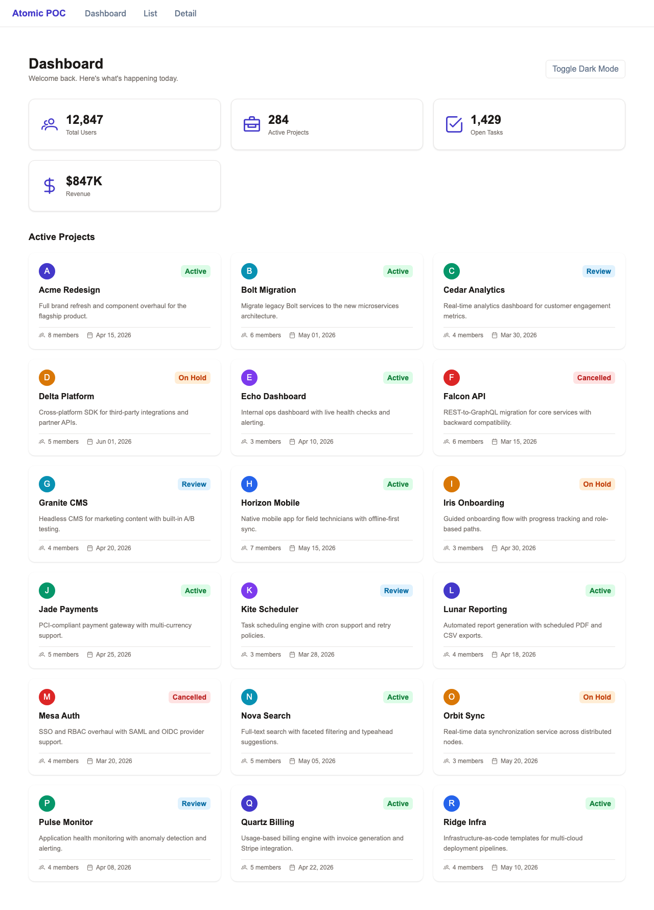
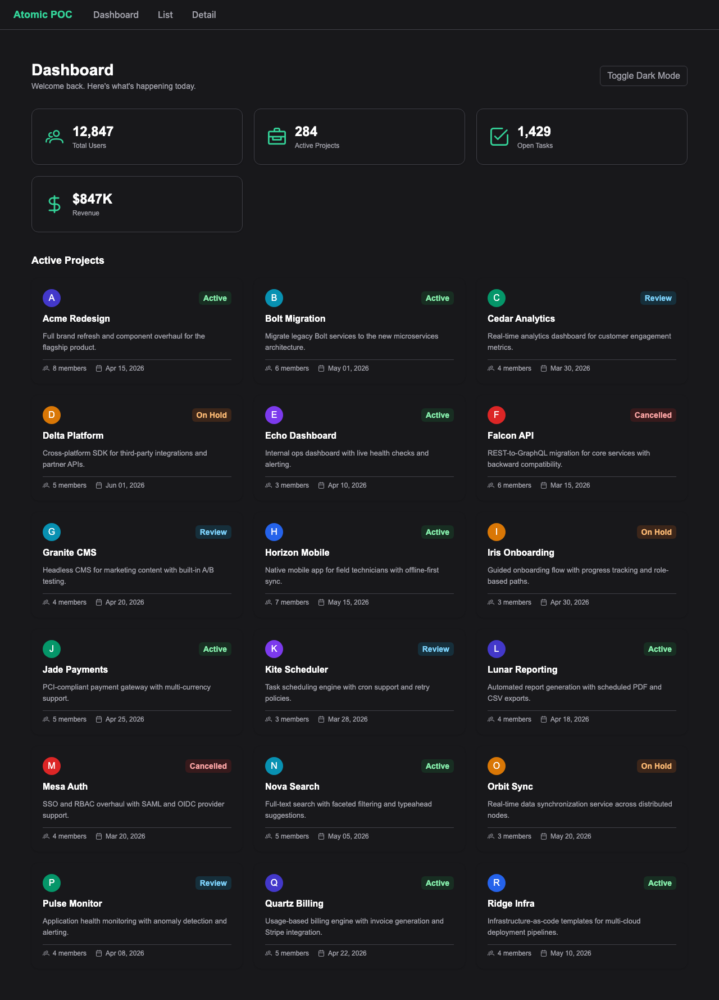
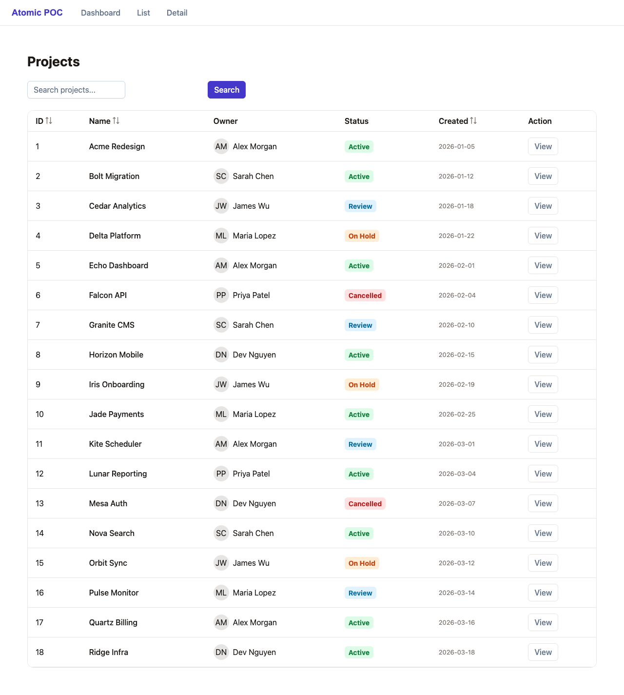
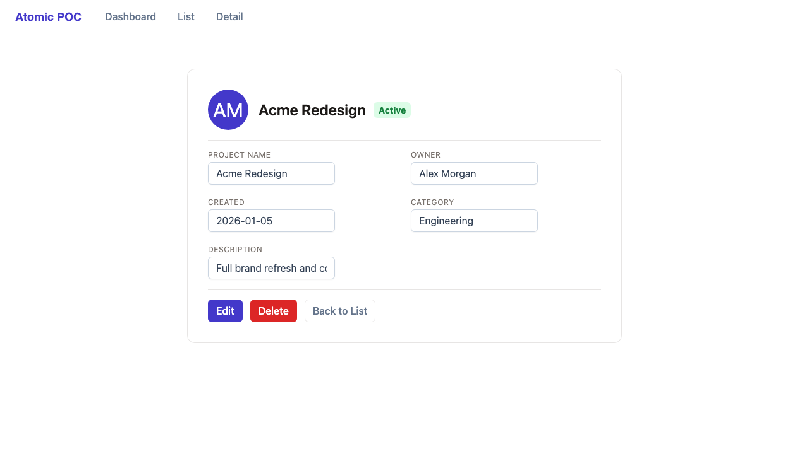
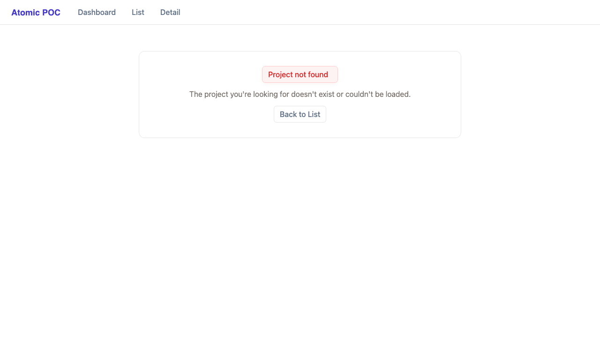
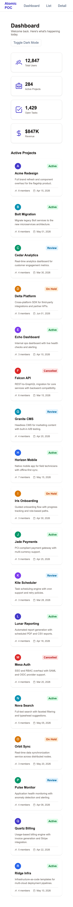
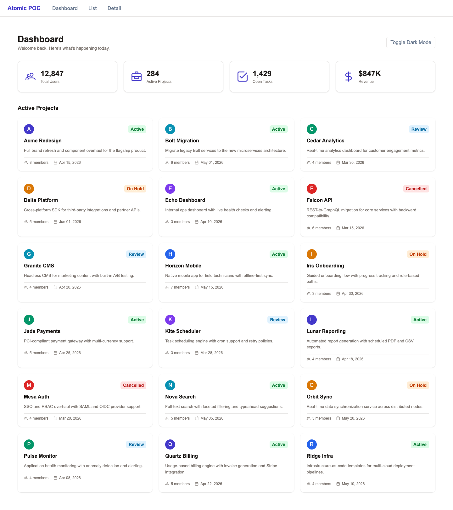

# Atomic Design Prototype

An Angular 21 + PrimeNG 21 prototype demonstrating atomic design methodology for small teams.

**[Browse the component library](https://roryford.github.io/atomic-prototype/)**

## What Is This?

This is a working prototype that demonstrates how to build a component library
using Brad Frost's Atomic Design principles in Angular 21 with PrimeNG 21. It
pairs real, runnable components with the process documentation a small team
needs to adopt atomic design without guesswork.

The repository includes process documentation (15 guides covering hierarchy,
tokens, QA, tooling, decision-making, and maturity stages) alongside working
code (4 atoms, 3 molecules, 3 organisms, and 3 pages). Every component is exercised in
Storybook and covered by Vitest unit tests.

Target audience: small teams (2-4 developers) building design systems. This
prototype is useful for learning atomic design concepts, Angular 21 patterns
(signals, httpResource, standalone components), and the surrounding process
(PBIs, acceptance criteria, testing strategy).

> **Note:** This repository is shared as a reference implementation. It is not
> actively accepting contributions.

> **Educational reference only.** This is a prototype built to demonstrate atomic design
> principles with Angular 21 and PrimeNG. It is not a production-ready library, not
> actively maintained as open-source, and not accepting contributions. Use it as a
> learning reference or fork it as a starting point — see [docs/14-replication-guide.md](docs/14-replication-guide.md).

## Screenshots

| Dashboard (light) | Dashboard (dark) |
|---|---|
|  |  |

| List page | Detail page | Error state |
|---|---|---|
|  |  |  |

| Mobile (375px) | Wide (1440px) |
|---|---|
|  |  |

## Atomic Design Hierarchy

```
Atoms                    Molecules                 Organisms
------------------       -------------------       -------------------------
DsButton                 DsSearchBar               DsStatGrid
DsInput                  DsStatCard                DsProjectCardGrid
DsTag                    DsFormField               DsProjectTable
DsEmptyState
                                                   Pages
                                                   -------------------------
                                                   Dashboard
                                                   List
                                                   Detail
```

## Quick Start

> **Note:** Node 25 is not a Long-Term Support (LTS) release. Plan to migrate to
> Node 26 LTS when it becomes available (expected mid-2026).

```
Prerequisites: Node 25+, npm 11+

git clone https://github.com/roryford/atomic-prototype.git
cd atomic-prototype
npm install
npm start              # Dev server at http://localhost:4200
npm run storybook      # Component library at http://localhost:6006
npm test               # 36 unit tests via Vitest
npm run lint           # ESLint (TypeScript + templates)
npm run lint:fix       # ESLint auto-fix
npm run e2e            # Playwright E2E tests (headless)
npm run e2e:ui         # Playwright E2E with UI
npm run build:tokens   # Regenerate preset.ts from tools/token-pipeline/tokens/primitives.json
```

## Project Structure

```
src/app/
  design-system/
    atoms/        — Button, Input, Tag, EmptyState
    molecules/    — SearchBar, StatCard, FormField
    organisms/    — StatGrid, ProjectCardGrid, ProjectTable
    tokens/       — PrimeNG theme preset, design tokens
  pages/          — Dashboard, List, Detail
  services/       — ProjectService (httpResource-based)
  mocks/          — MSW handlers + fixture data
docs/             — Process guides (00-14) + prototype findings
```

## What's Implemented

- **4 atoms:** DsButton, DsTag, DsInput, DsEmptyState
- **3 molecules:** DsStatCard, DsSearchBar, DsFormField
- **3 organisms:** DsStatGrid, DsProjectCardGrid, DsProjectTable
- **3 pages:** Dashboard, List, Detail
- **Tooling:** CI (GitHub Actions), ESLint, Stylelint, Playwright E2E, Storybook, Vitest, MSW mocks

Not yet implemented: templates (directory exists as placeholder), real API integration, authentication, visual regression testing, axe-core in CI, performance budgets in CI.

## Known Limitations

This is a prototype scoped to demonstrate atomic design methodology, not a production design system. These limitations are intentional — they mark where the prototype ends and production work begins.

**Theming.** One theme with light and dark modes. No multi-brand support, density modes, or high-contrast accessibility themes. The token architecture supports these — the preset structure allows multiple themes via `definePreset()` — but only one is implemented.

**Layout primitives.** Pages use CSS grid and flex directly. There are no reusable layout components (grid, spacer, container, shell). The templates level in the atomic hierarchy is scaffolded but empty. A production system would need layout primitives before scaling past a handful of pages.

**Accessibility automation.** Manual a11y checklists exist (see [QA per atomic level](./docs/07-qa-per-atomic-level.md) and [manual test checklist](./docs/manual-test-checklist.md)), Storybook has the a11y addon installed, and keyboard navigation rules are documented per level. What's missing is automated enforcement — axe-core is not in CI. Manual review catches issues; automation prevents regressions.

**Forms.** DsFormField demonstrates the molecule pattern, but there is no form validation framework, error strategy, or form layout system. PrimeNG forms are used minimally. Production forms need dedicated patterns.

**Backend.** MSW provides realistic API mocking gated behind `isDevMode()`. There is no API client abstraction, auth flow, or real data layer. This is intentional — it keeps the prototype focused on UI architecture.

**Internationalization.** No i18n pipeline, RTL support, or locale-aware formatting. These are production concerns that interact heavily with the token and component layers but are outside the scope of demonstrating atomic structure.

**Icons.** PrimeIcons are used via PrimeNG. There is no custom icon library, icon tokens, or icon component. A production system with custom iconography would need these.

**Motion.** PrimeNG controls its own animation lifecycle. There are no custom duration tokens, easing tokens, or motion guidelines. Custom animation patterns would need to be layered on top.

**Figma library.** This is a code-first prototype. There is no shared Figma file or component spec library in the repository. A local Figma plugin is included at [`tools/figma-plugin`](./tools/figma-plugin/) for manual primitive-token import/export, but it is a prototype workflow helper rather than a full design-library sync setup. The [Designer's Guide](./docs/13-designers-guide.md) describes the broader handoff workflow.

**Distribution.** This is a reference repository, not a publishable npm package. There is no versioning strategy, monorepo structure, or release pipeline. See [production plan sketch](./docs/production-plan-sketch.md) for notes on what a production release pipeline would require.

## Documentation

See [docs/README.md](./docs/README.md) for the full documentation index and role-based reading paths. Start with the [Quickstart Guide](./docs/00-quickstart.md).

## Tech Stack

- Angular 21.2, PrimeNG 21.1, Storybook 10.3, Vitest 4.1, MSW 2.12, TypeScript 5.9
- ESLint (via angular-eslint), Playwright (E2E), GitHub Actions (CI/CD)

## License

MIT — see [LICENSE](./LICENSE).
