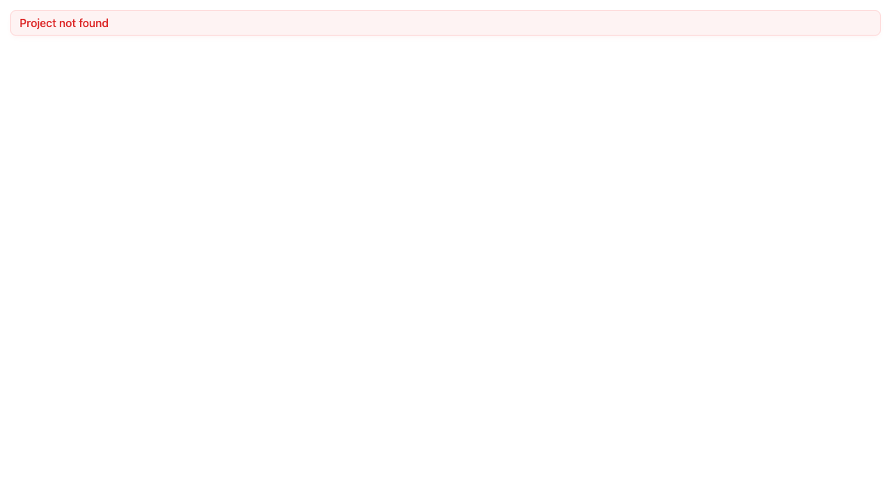
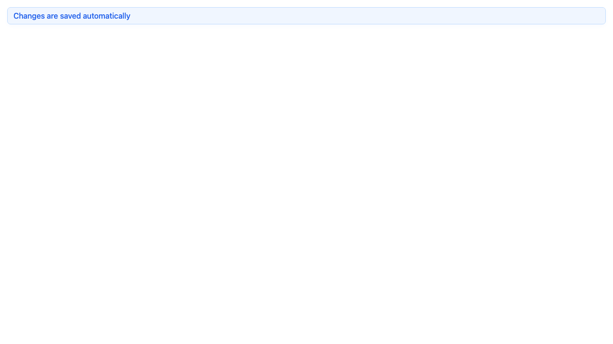
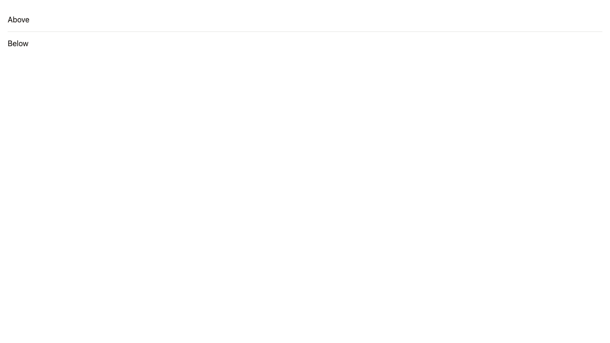

# Component Catalogue

> Visual reference for every design-system component, captured from Storybook. Regenerate with `npm run screenshots:components`.

## Contents

- [Level 1 — Atoms](#level-1--atoms): [DsButton](#dsbutton) · [DsTag](#dstag) · [DsInput](#dsinput) · [DsEmptyState](#dsemptystate) · [DsSkeleton](#dsskeleton) · [DsMessage](#dsmessage) · [DsDivider](#dsdivider)
- [Level 2 — Molecules](#level-2--molecules): [DsStatCard](#dsstatcard) · [DsSearchBar](#dssearchbar) · [DsFormField](#dsformfield)
- [Level 3 — Organisms](#level-3--organisms): [DsStatGrid](#dsstatgrid) · [DsProjectCardGrid](#dsprojectcardgrid) · [DsProjectTable](#dsprojecttable) · [DsProjectDetailCardSkeleton](#dsprojectdetailcardskeleton)
- [The Cascade in Practice](#the-cascade-in-practice)

---

## Level 1 — Atoms

Thin wrappers around a single PrimeNG primitive or native HTML element. Purely presentational, no business logic.

### DsButton
[`button.ts`](../src/app/design-system/atoms/button/button.ts) · [`button.stories.ts`](../src/app/design-system/atoms/button/button.stories.ts) · [`button.spec.ts`](../src/app/design-system/atoms/button/button.spec.ts)

| Primary | Secondary | Danger | Outlined |
|---|---|---|---|
|  |  |  |  |

### DsTag
[`tag.ts`](../src/app/design-system/atoms/tag/tag.ts) · [`tag.stories.ts`](../src/app/design-system/atoms/tag/tag.stories.ts) · [`tag.spec.ts`](../src/app/design-system/atoms/tag/tag.spec.ts)

| Success | Warning | Danger | Info |
|---|---|---|---|
|  |  |  |  |

### DsInput
[`input.ts`](../src/app/design-system/atoms/input/input.ts) · [`input.stories.ts`](../src/app/design-system/atoms/input/input.stories.ts) · [`input.spec.ts`](../src/app/design-system/atoms/input/input.spec.ts)

| Default | With placeholder |
|---|---|
|  |  |

### DsEmptyState
[`empty-state.ts`](../src/app/design-system/atoms/empty-state/empty-state.ts) · [`empty-state.stories.ts`](../src/app/design-system/atoms/empty-state/empty-state.stories.ts) · [`empty-state.spec.ts`](../src/app/design-system/atoms/empty-state/empty-state.spec.ts)

| Default (no action) | With action button |
|---|---|
|  |  |

### DsSkeleton
[`skeleton.ts`](../src/app/design-system/atoms/skeleton/skeleton.ts) · [`skeleton.stories.ts`](../src/app/design-system/atoms/skeleton/skeleton.stories.ts) · [`skeleton.spec.ts`](../src/app/design-system/atoms/skeleton/skeleton.spec.ts)

Loading placeholder. `size` overrides width/height for square/circular shapes.

| Text | Circle |
|---|---|
|  |  |

### DsMessage
[`message.ts`](../src/app/design-system/atoms/message/message.ts) · [`message.stories.ts`](../src/app/design-system/atoms/message/message.stories.ts) · [`message.spec.ts`](../src/app/design-system/atoms/message/message.spec.ts)

Inline status message with a severity colour.

| Error | Info |
|---|---|
|  |  |

### DsDivider
[`divider.ts`](../src/app/design-system/atoms/divider/divider.ts) · [`divider.stories.ts`](../src/app/design-system/atoms/divider/divider.stories.ts) · [`divider.spec.ts`](../src/app/design-system/atoms/divider/divider.spec.ts)

Section separator (horizontal/vertical, solid/dashed/dotted).

| Horizontal | Dashed |
|---|---|
|  |  |

---

## Level 2 — Molecules

Compositions of 2–4 atoms that function as a single reusable unit.

### DsStatCard
[`stat-card.ts`](../src/app/design-system/molecules/stat-card/stat-card.ts) · [`stat-card.stories.ts`](../src/app/design-system/molecules/stat-card/stat-card.stories.ts) · [`stat-card.spec.ts`](../src/app/design-system/molecules/stat-card/stat-card.spec.ts)


### DsSearchBar
[`search-bar.ts`](../src/app/design-system/molecules/search-bar/search-bar.ts) · [`search-bar.stories.ts`](../src/app/design-system/molecules/search-bar/search-bar.stories.ts) · [`search-bar.spec.ts`](../src/app/design-system/molecules/search-bar/search-bar.spec.ts)


### DsFormField
[`form-field.ts`](../src/app/design-system/molecules/form-field/form-field.ts) · [`form-field.stories.ts`](../src/app/design-system/molecules/form-field/form-field.stories.ts) · [`form-field.spec.ts`](../src/app/design-system/molecules/form-field/form-field.spec.ts)

| Default | Full width |
|---|---|
|  |  |

---

## Level 3 — Organisms

Complex, self-contained UI sections where real data enters. Every organism handles four states: loading, error, empty, and data.

### DsStatGrid
[`stat-grid.ts`](../src/app/design-system/organisms/stat-grid/stat-grid.ts) · [`stat-grid.html`](../src/app/design-system/organisms/stat-grid/stat-grid.html) · [`stat-grid.stories.ts`](../src/app/design-system/organisms/stat-grid/stat-grid.stories.ts) · [`stat-grid.spec.ts`](../src/app/design-system/organisms/stat-grid/stat-grid.spec.ts)

| Loading | Error |
|---|---|
|  |  |

| Empty | Data |
|---|---|
|  |  |

### DsProjectCardGrid
[`project-card-grid.ts`](../src/app/design-system/organisms/project-card-grid/project-card-grid.ts) · [`project-card-grid.html`](../src/app/design-system/organisms/project-card-grid/project-card-grid.html) · [`project-card-grid.stories.ts`](../src/app/design-system/organisms/project-card-grid/project-card-grid.stories.ts) · [`project-card-grid.spec.ts`](../src/app/design-system/organisms/project-card-grid/project-card-grid.spec.ts)

| Loading | Error |
|---|---|
|  |  |

| Empty | Data |
|---|---|
|  |  |

### DsProjectTable
[`project-table.ts`](../src/app/design-system/organisms/project-table/project-table.ts) · [`project-table.html`](../src/app/design-system/organisms/project-table/project-table.html) · [`project-table.stories.ts`](../src/app/design-system/organisms/project-table/project-table.stories.ts) · [`project-table.spec.ts`](../src/app/design-system/organisms/project-table/project-table.spec.ts)

| Loading | Error |
|---|---|
|  |  |

| Empty | Data |
|---|---|
|  |  |

| Search — no results |
|---|
|  |

### DsProjectDetailCardSkeleton
[`project-detail-card-skeleton.ts`](../src/app/design-system/organisms/project-detail-card-skeleton/project-detail-card-skeleton.ts) · [`project-detail-card-skeleton.html`](../src/app/design-system/organisms/project-detail-card-skeleton/project-detail-card-skeleton.html) · [`project-detail-card-skeleton.stories.ts`](../src/app/design-system/organisms/project-detail-card-skeleton/project-detail-card-skeleton.stories.ts) · [`project-detail-card-skeleton.spec.ts`](../src/app/design-system/organisms/project-detail-card-skeleton/project-detail-card-skeleton.spec.ts)

Loading placeholder that mirrors `DsProjectDetailCard`'s layout, composed from `DsSkeleton` + `DsDivider`. Lets the Detail page swap one component for its loading state instead of composing skeleton primitives inline.

| Loading |
|---|
|  |

---

## The Cascade in Practice

```
Atoms          →  DsButton, DsTag, DsInput, DsEmptyState, DsSkeleton, DsMessage, DsDivider
                      ↓
Molecules      →  DsStatCard (icon + value + label)
                   DsSearchBar (DsInput + DsButton)
                   DsFormField (label + ng-content)
                      ↓
Organisms      →  DsStatGrid (DsStatCard × N)
                   DsProjectCardGrid (DsTag + DsButton + avatars)
                   DsProjectTable (DsSearchBar + DsTag + DsButton + DsEmptyState + p-table)
                   DsProjectDetailCardSkeleton (DsSkeleton + DsDivider)
                      ↓
Pages          →  Dashboard, List, Detail
                   Detail loading → DsProjectDetailCardSkeleton
                   Detail error   → DsMessage + DsButton
                   Detail data    → DsProjectDetailCard
```

Each level consumes components from the level below. Atoms never import molecules. Molecules never import organisms.
