# Component Catalogue

> Visual reference for every design-system component, captured from Storybook. Regenerate with `npm run screenshots:components`.

## Contents

- [Level 1 — Atoms](#level-1--atoms): [DsButton](#dsbutton) · [DsTag](#dstag) · [DsInput](#dsinput) · [DsEmptyState](#dsemptystate)
- [Level 2 — Molecules](#level-2--molecules): [DsStatCard](#dsstatcard) · [DsSearchBar](#dssearchbar) · [DsFormField](#dsformfield)
- [Level 3 — Organisms](#level-3--organisms): [DsStatGrid](#dsstatgrid) · [DsProjectCardGrid](#dsprojectcardgrid) · [DsProjectTable](#dsprojecttable)
- [The Cascade in Practice](#the-cascade-in-practice)

---

## Level 1 — Atoms

Thin wrappers around a single PrimeNG primitive or native HTML element. Purely presentational, no business logic.

### DsButton

| Primary | Secondary | Danger | Outlined |
|---|---|---|---|
|  |  |  |  |

### DsTag

| Success | Warning | Danger | Info |
|---|---|---|---|
|  |  |  |  |

### DsInput

| Default | With placeholder |
|---|---|
|  |  |

### DsEmptyState

| Default (no action) | With action button |
|---|---|
| 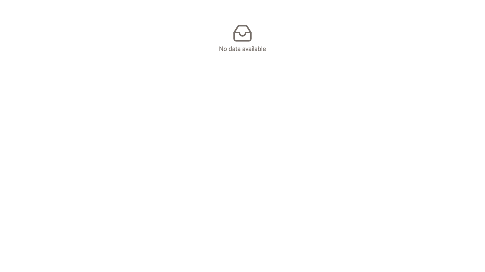 | 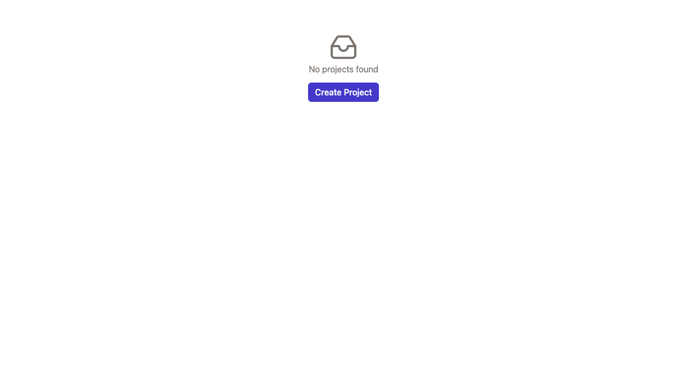 |

---

## Level 2 — Molecules

Compositions of 2–4 atoms that function as a single reusable unit.

### DsStatCard

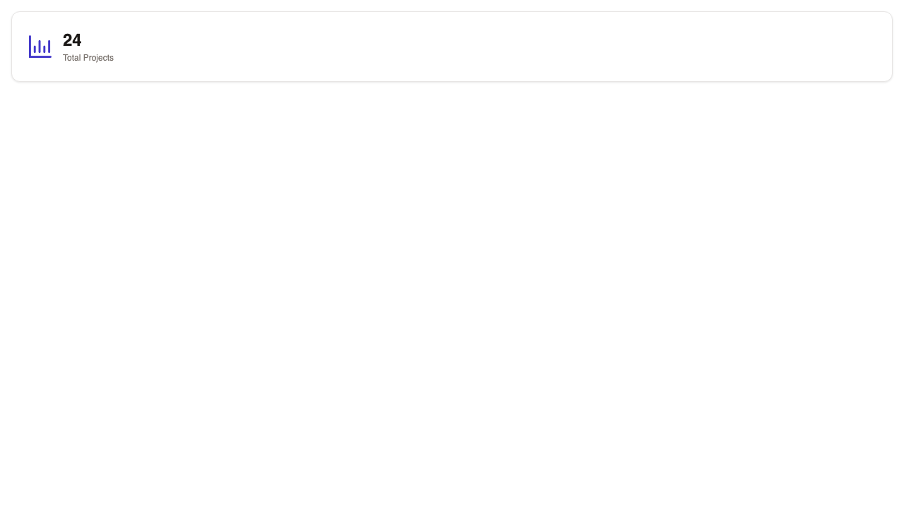

### DsSearchBar

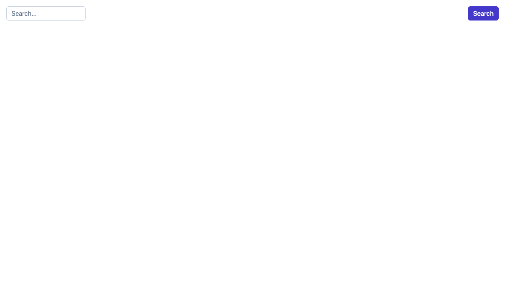

### DsFormField

| Default | Full width |
|---|---|
|  |  |

---

## Level 3 — Organisms

Complex, self-contained UI sections where real data enters. Every organism handles four states: loading, error, empty, and data.

### DsStatGrid

| Loading | Error |
|---|---|
|  | 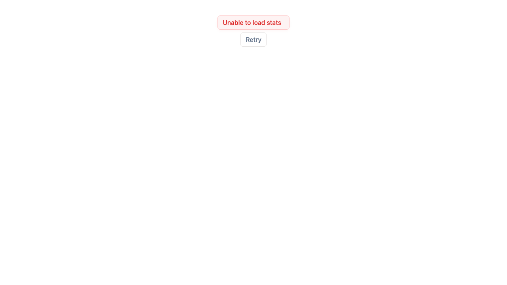 |

| Empty | Data |
|---|---|
| 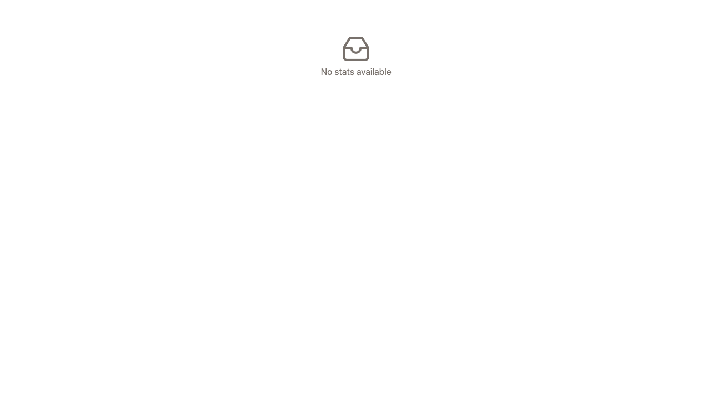 | 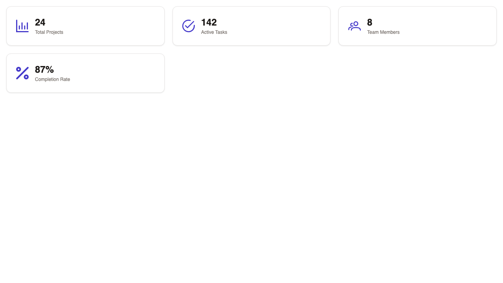 |

### DsProjectCardGrid

| Loading | Error |
|---|---|
|  |  |

| Empty | Data |
|---|---|
|  | 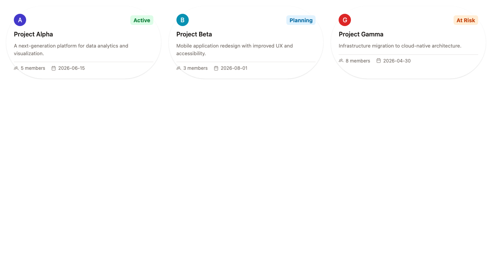 |

### DsProjectTable

| Loading | Error |
|---|---|
|  | 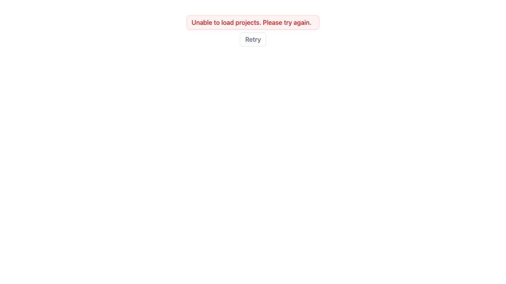 |

| Empty | Data |
|---|---|
| 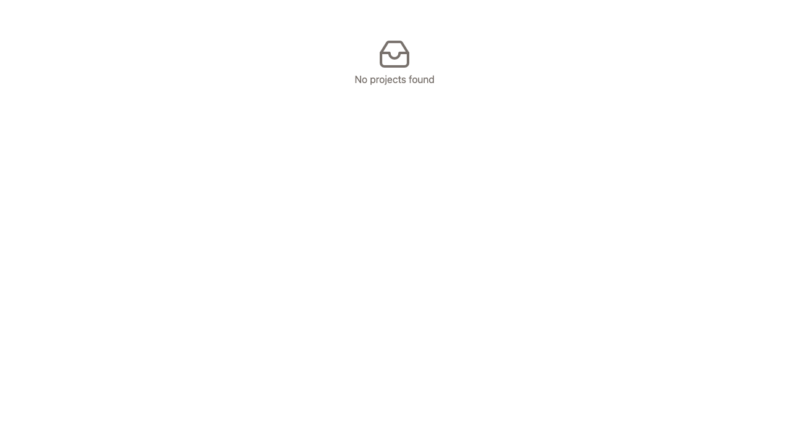 |  |

| Search — no results |
|---|
| 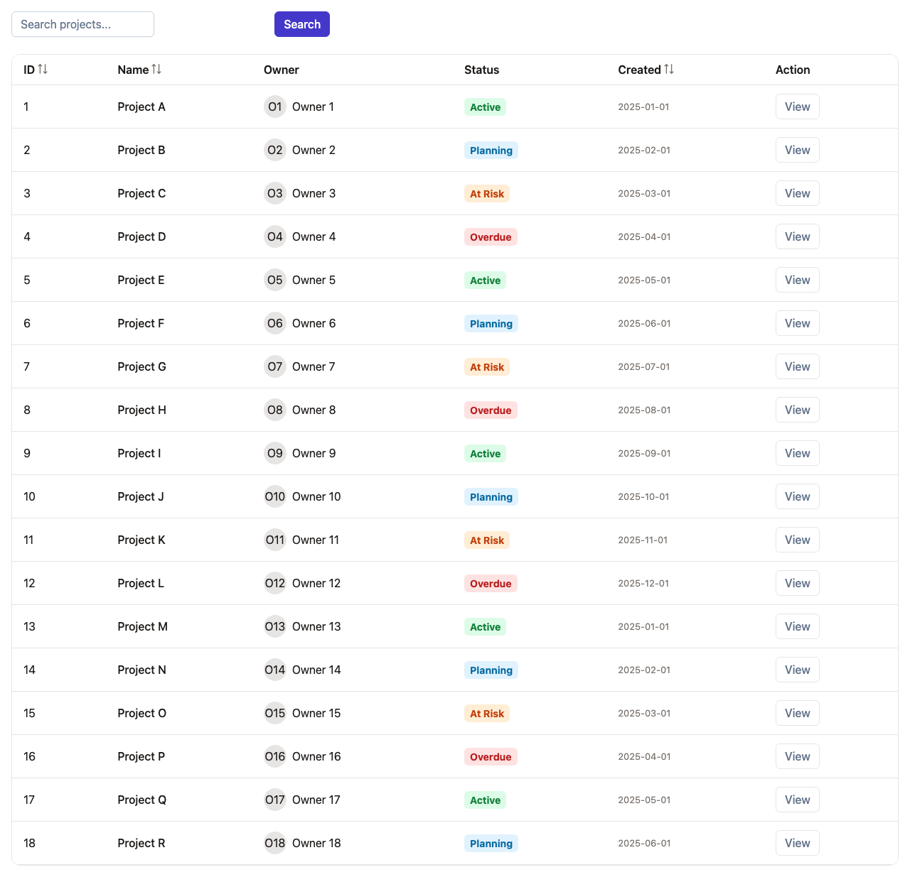 |

---

## The Cascade in Practice

```
Atoms          →  DsButton, DsTag, DsInput, DsEmptyState
                      ↓
Molecules      →  DsStatCard (icon + value + label)
                   DsSearchBar (DsInput + DsButton)
                   DsFormField (label + ng-content)
                      ↓
Organisms      →  DsStatGrid (DsStatCard × N)
                   DsProjectCardGrid (DsTag + DsButton + avatars)
                   DsProjectTable (DsSearchBar + DsTag + DsButton + DsEmptyState + p-table)
                      ↓
Pages          →  Dashboard, List, Detail
```

Each level consumes components from the level below. Atoms never import molecules. Molecules never import organisms.
