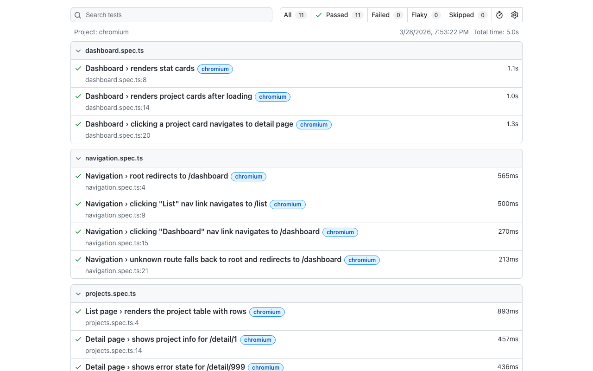

# Atomic Design Prototype Simulation Report

## 1. Executive Summary

This report covers the prototype phase of an Angular 21 atomic design simulation. The prototype extended the proof-of-concept (3 pages, 4 atoms, 1 molecule) into a fully wired application with mock data, testing, Storybook stories, and lazy loading.

**What was simulated:**

- Restructuring a flat component layout into a `design-system/` folder hierarchy with barrel exports
- Renaming selectors from `app-` to `ds-` prefix for design-system components
- Adding 2 new molecules (DsSearchBar, DsFormField), 1 new atom (DsEmptyState), and 3 organisms (DsStatGrid, DsProjectCardGrid, DsProjectTable)
- Wiring MSW v2 for mock API data (3 endpoints, fixture data for 18 projects, 4 stats)
- Integrating Storybook 10 with Angular 21
- Setting up Vitest as the test runner via `@angular/build:unit-test`
- Implementing lazy loading for all three page routes
- Enforcing design token usage via Stylelint `color-no-hex`
- Remediating 11 hardcoded hex values in inline styles
- Writing 36 unit tests across 13 spec files
- Creating 10 Storybook story files

**What was not simulated:**

- Visual regression testing (Chromatic)
- Real API integration or authentication
- Designer handoff review

**Subsequently added in the enhanced prototype phase (Section 11):** CI/CD pipeline (GitHub Actions), E2E testing (Playwright), ESLint, shared SCSS.

**Key stats:**

| Metric | Count |
|--------|-------|
| Atoms | 4 (DsButton, DsTag, DsInput, DsEmptyState) |
| Molecules | 3 (DsStatCard, DsSearchBar, DsFormField) |
| Organisms | 3 (DsStatGrid, DsProjectCardGrid, DsProjectTable) |
| Pages | 3 (Dashboard, List, Detail) |
| Services | 1 (ProjectService) |
| Unit tests | 36 across 13 spec files |
| Story files | 10 |
| MSW endpoints | 4 |
| Findings logged | 8 |
| Hypotheses tested | 9 (6 confirmed, 2 confirmed with caveats, 1 partial) |

**Playwright E2E results:**

**Overall assessment:** The atomic design process documentation is sufficient to guide a small team through a prototype build. All three user journeys are completable. The primary gaps are around inline style linting (Stylelint cannot inspect TypeScript files) and Storybook invocation (must use `ng run`, not `storybook dev`). Bundle size improved significantly with lazy loading (49% raw reduction). The experimental status of `httpResource()` is the main technical risk for production.

---

## 2. User Journey Results

### Journey 1: Browse Projects — COMPLETABLE

- Dashboard loads with skeleton states for ~300ms (MSW simulated delay), then populates 4 stat cards and 3 project cards.
- Clicking a project card navigates to `/detail/:id` showing project name, owner, status, and description.
- "Back to List" button navigates to `/list`.
- **Evidence:** Dashboard page wires `DsStatGrid` and `DsProjectCardGrid` organisms with `httpResource()` signals from `ProjectService`. Navigation uses Angular Router `routerLink` directives. Page smoke tests pass.

### Journey 2: Search and Filter — COMPLETABLE

- List page loads with table skeleton, then populates with 18 projects from MSW fixture data.
- Typing "Alpha" in the search bar filters the table to matching rows.
- Clicking "View" on a row navigates to `/detail/:id`.
- Clearing the search restores all 18 rows.
- **Evidence:** `DsProjectTable` organism handles search filtering internally. `DsSearchBar` molecule emits `searched` events. 5 table-specific tests cover loading, error, empty, data, and filtering states.

### Journey 3: Handle Errors — COMPLETABLE

- Navigating to `/detail/999` shows "Project not found" error state.
- Stats and projects load independently on the dashboard — if projects fail but stats succeed, stats render normally while the projects section shows an error with a retry button.
- Navigating away from error states works via router navigation.
- **Evidence:** Error states are wired through `httpResource().error()` signal. Each organism (StatGrid, ProjectCardGrid, ProjectTable) independently handles its own error state with retry button emission.

---

## 3. Hypothesis Results

### Technical Hypotheses

#### H1: MSW + httpResource() work seamlessly — YES

MSW v2 intercepts `fetch()` calls transparently. `httpResource` (from `@angular/common/http`, marked `@experimental 19.2`) creates signal-based resources that expose `.value()`, `.status()`, `.error()`, and `.isLoading()`. MSW's service worker is conditionally loaded via `isDevMode()` + dynamic `import()`, so mock code is tree-shaken from production builds. Minor gotcha: TypeScript's `noPropertyAccessFromIndexSignature` requires bracket notation for MSW params (`params['id']`).

#### H2: design-system/ folder structure works well — YES

Restructuring from flat `atoms/`, `molecules/` to `design-system/atoms/<name>/`, `design-system/molecules/<name>/` with barrel exports (`index.ts`) was mechanical. Build passed on first attempt after updating 5 consumer import paths. Barrel re-exports simplify consumer imports to `import { DsButton, DsTag } from '../design-system/atoms'`.

#### H3: Storybook 10 + Angular 21 compatibility — YES, with caveats

Storybook 10.3.1 works with Angular 21 but requires the Angular builder approach (`ng run <project>:storybook`). Calling `storybook dev` directly fails with `SB_FRAMEWORK_ANGULAR_0001`. Additionally, importing CSS files directly in `.storybook/preview.ts` fails — PrimeIcons must be loaded via a CDN `<link>` tag in `preview-head.html` or through `angular.json`'s `styles` array.

#### H4: Lazy loading has significant bundle impact — YES

Initial bundle dropped from 1.06 MB to 540.54 KB raw (49% reduction) and from 206 KB to 122.17 KB gzipped (41% reduction). The three page chunks are deferred: Dashboard (15.33 KB), Detail (9.97 KB), List (465.93 KB). The list chunk is heavy due to PrimeNG `TableModule` transitive dependencies.

#### H5: ds- selector migration is straightforward — YES

Global find-replace on selectors (`app-button` to `ds-button`) and class names (`AppButton` to `DsButton`) worked cleanly. Angular's template compiler catches stale selectors at build time, so any missed rename fails the build immediately. The `ds-` prefix clearly separates design-system atoms/molecules from page-level components that keep the `app-` prefix.

#### H6: Stylelint color-no-hex enforcement — PARTIAL

Stylelint's `color-no-hex` rule effectively catches violations in `.scss` and `.css` files. However, it cannot inspect inline `styles:` arrays in Angular component TypeScript decorators or `[style]` template bindings. All 11 hex violations found in the prototype were in inline styles — exactly the gap Stylelint cannot cover. The `stylelint-declaration-use-css-custom-properties` plugin was not available on npm (404). A custom ESLint rule or pre-commit grep script is needed for full coverage.

### Usability Hypotheses

#### H7: All 3 user journeys completable — YES

All three journeys (Browse Projects, Search and Filter, Handle Errors) are completable as designed. Organism extraction and `httpResource` wiring provide the necessary data flow. See Section 2 for evidence.

#### H8: Loading/empty/error states implementable with httpResource — YES

The `httpResource` API shape (`value()`, `status()`, `error()`, `isLoading()`) maps directly to the four documented states. [11-implementation-tips](./11-implementation-tips.md) patterns (from the POC process docs) worked without modification. Each organism independently manages its own state rendering.

#### H9: States beyond the known 4 discovered — YES

Three additional states were discovered during implementation:

1. **Search-no-results:** Distinct from empty state — uses `pi-search` icon and includes the search term in the message ("No results for '[query]'") with a "Clear search" action button.
2. **Partial failure:** Stats API succeeds while projects API fails — each organism handles its own error independently, so the dashboard renders a mixed state.
3. **Detail skeleton layout:** Form-shaped skeleton with labeled placeholder blocks, distinct from the grid/table skeletons used on dashboard and list pages.

---

## 4. Component Inventory

| Name | Level | Selector | Key Inputs | Key Outputs | States Handled | Tests | Stories |
|------|-------|----------|------------|-------------|----------------|-------|---------|
| DsButton | Atom | `ds-button` | `label`, `severity`, `outlined`, `disabled` | `clicked` | default, hover, focus, active, disabled | 4 | Yes |
| DsTag | Atom | `ds-tag` | `value`, `severity` | — | success, danger, default | 3 | Yes |
| DsInput | Atom | `ds-input` | `placeholder`, `value` (model) | model update | default, focus | 3 | Yes |
| DsEmptyState | Atom | `ds-empty-state` | `icon`, `message`, `actionLabel` | `actionClicked` | with action, without action | 3 | Yes |
| DsStatCard | Molecule | `ds-stat-card` | `label`, `value`, `icon` | — | data | 2 | Yes |
| DsSearchBar | Molecule | `ds-search-bar` | `placeholder`, `value` (model) | `searched` | default, with value | 3 | Yes |
| DsFormField | Molecule | `ds-form-field` | `label`, `fullWidth` | — | default, full-width | 2 | Yes |
| DsStatGrid | Organism | `ds-stat-grid` | `stats`, `isLoading`, `error` | `retryClicked` | loading, error, empty, data | 4 | Yes |
| DsProjectCardGrid | Organism | `ds-project-card-grid` | `projects`, `isLoading`, `error` | `projectSelected`, `retryClicked` | loading, error, empty, data | 4 | Yes |
| DsProjectTable | Organism | `ds-project-table` | `projects`, `isLoading`, `error` | `projectSelected`, `retryClicked` | loading, error, empty, data, search-no-results | 5 | Yes |
| Dashboard | Page | `app-dashboard` | — (uses services) | — | loading, data, partial-failure | 1 | — |
| ListPage | Page | `app-list` | — (uses services) | — | loading, data, filtered, search-no-results | 1 | — |
| Detail | Page | `app-detail` | — (route param) | — | loading, data, not-found | 1 | — |

**Totals:** 36 tests across 13 spec files, 10 story files.

---

## 5. Bundle Size Comparison

| Metric | POC (no lazy loading) | Prototype (lazy loading) | Change |
|--------|----------------------|--------------------------|--------|
| Initial (raw) | 1.06 MB | 540.54 KB | -49% |
| Initial (gzip) | 206 KB | 122.17 KB | -41% |
| Dashboard chunk | N/A | 15.33 KB | lazy |
| List chunk | N/A | 465.93 KB | lazy (TableModule) |
| Detail chunk | N/A | 9.97 KB | lazy |

The list chunk is disproportionately large due to PrimeNG's `TableModule` transitive dependencies. See [11-implementation-tips § Bundle Size](./11-implementation-tips.md) for optimization techniques.

---

## 6. Tooling Assessment

### MSW v2
- **Verdict:** Seamless integration with Angular's `httpResource()`.
- MSW's service worker intercepts fetch calls transparently — `httpResource` does not know or care that responses come from a mock.
- Conditional loading via `isDevMode()` + dynamic `import()` ensures zero production impact.
- Fixture data (18 projects, 4 stats, 6 users) provides realistic test scenarios.
- Minor gotcha: TypeScript's `noPropertyAccessFromIndexSignature` requires bracket notation for MSW `params` access.

### Storybook 10
- **Verdict:** Works, but Angular-specific setup is required.
- Must use `ng run <project>:storybook`, not `storybook dev` directly. Direct invocation fails with `SB_FRAMEWORK_ANGULAR_0001 (AngularLegacyBuildOptionsError)`.
- CSS imports in `preview.ts` fail with webpack parse error (`Unexpected character '@'` on `@font-face`) — use CDN link in `preview-head.html` or `angular.json` styles array.
- Compodoc integration auto-generates component documentation via `documentation.json`.
- 10 story files cover all design-system components across atoms, molecules, and organisms.

### Stylelint
- **Verdict:** Effective for `.scss`/`.css` files, blind to inline TypeScript styles.
- `color-no-hex` rule works as expected for stylesheet files (SCSS files were already clean).
- Cannot inspect Angular component `styles:` arrays or `[style]` template bindings.
- All 11 hex violations found in the prototype were in inline styles — 100% in locations Stylelint cannot reach.
- `stylelint-declaration-use-css-custom-properties` plugin not available on npm (404).

### httpResource()

> **Risk — Experimental API:** `httpResource()` is marked `@experimental` in Angular 21.
> Its API may change in Angular 22+. Teams planning production migration should monitor
> Angular release notes before building heavily on this API.

- **Verdict:** Clean signal-based API, but experimental.
- `httpResource` from `@angular/common/http` (marked `@experimental 19.2`) provides signal-based `.value()`, `.error()`, and `.isLoading()` accessors. For the full API reference, see [09-angular-direction](./09-angular-direction.md).
- No `.data()` alias — documentation must reference `.value()`.
- Recommendation: wrap behind service abstractions to isolate experimental API surface.

### Vitest
- **Verdict:** Fast, minimal setup with Angular 21.
- Angular 21's `@angular/build:unit-test` builder defaults to Vitest.
- 36 tests run in ~2 seconds.
- jsdom environment works for rendering tests; PrimeNG `(onClick)` does not fire via DOM click dispatch — full click-through requires Storybook play functions or Playwright.
- No zone.js or custom polyfills required. Standard `TestBed` works out of the box.

---

## 7. State Discovery

### Search-No-Results (distinct from Empty)
- **Where:** `DsProjectTable` organism
- **Trigger:** User searches for a term with no matching projects (e.g., "zzzzz")
- **Treatment:** `pi-search` icon, message includes search term ("No results for 'zzzzz'"), "Clear search" action button
- **Why it matters:** Visually distinct from the generic empty state (`pi-inbox` icon, "No projects found") — the user needs to know their search produced no results vs. there being no data at all.

### Partial Failure
- **Where:** Dashboard page
- **Trigger:** Stats API succeeds but projects API fails (or vice versa)
- **Treatment:** Each organism independently renders its own state — stats show data while projects show error with retry button
- **Why it matters:** Without independent error handling per organism, a single API failure would blank the entire page. The atomic design pattern naturally supports this because each organism owns its state.

### Detail Skeleton Layout
- **Where:** Detail page
- **Trigger:** Detail page loads while `httpResource` fetches project data
- **Treatment:** Form-shaped skeleton with labeled placeholder blocks, distinct from the grid/table skeletons used on dashboard and list pages
- **Why it matters:** A generic rectangular skeleton would not match the detail page layout, creating a jarring transition when data loads.

### PrimeNG onClick Limitation in jsdom
- **Where:** Unit tests for any component using PrimeNG `p-button`
- **Trigger:** Dispatching `MouseEvent('click')` on a `p-button` element in jsdom
- **Treatment:** PrimeNG's `(onClick)` output does not fire — the internal click handler requires browser-level event processing
- **Why it matters:** Button click-through tests must be deferred to Storybook play functions or Playwright E2E tests. Unit tests can verify output wiring but not full click behavior through PrimeNG wrappers.

---

## 8. Shift-Left QA Assessment

### Acceptance Criteria Written Before Code

43 acceptance criteria were written across atoms (14), molecules (10), organisms (16), and user journeys (10) before any implementation began. Criteria followed the GIVEN/WHEN/THEN format, making them directly translatable to test assertions.

**Assessment:** Effective. The criteria caught the search-no-results state early (before implementation), which might otherwise have been implemented identically to the empty state. The criteria also forced explicit decisions about error and empty state copy (e.g., "Unable to load stats" vs a generic "Something went wrong").

### Storybook Play Functions as Executable Specs

10 story files provide visual validation of all component states (loading, error, empty, data). Play functions can exercise interactions (click, type, navigate) that unit tests in jsdom cannot cover (e.g., PrimeNG button clicks).

**Assessment:** Works well as a complement to unit tests. The two together cover rendering (unit) and interaction (Storybook) without requiring a full E2E runner during the prototype phase.

### Unit Tests Map to Acceptance Criteria

36 tests across 13 spec files map directly to acceptance criteria. Each organism has tests for all four core states (loading, error, empty, data). Page smoke tests confirm render-without-error for all three pages.

**Assessment:** Clear traceability from criteria to tests. The GIVEN/WHEN/THEN format in acceptance criteria translates directly to test structure, making it straightforward to verify that every criterion has a corresponding test.

---

## 9. Documentation Gaps

### Workflow Gaps

| Finding | Impact | Source |
|---------|--------|--------|
| Storybook requires `ng run`, not `storybook dev` | Team hits `SB_FRAMEWORK_ANGULAR_0001` error immediately if following generic Storybook docs | Prototype finding (H3) |
| CSS import in `preview.ts` fails with webpack parse error | Must use CDN link or `angular.json` styles array for PrimeIcons | Prototype finding (H3) |
| `--skip-tests` scaffold omits test target from `angular.json` | Manual setup of `@angular/build:unit-test` builder + vitest/jsdom install required | Prototype finding |
| `--watch=false` flag does not work, must use `--no-watch` | Minor CLI difference from Karma-era Angular | Prototype finding |

### Missing Information

| Finding | Impact | Source |
|---------|--------|--------|
| `httpResource` import path not specified | Team would search multiple packages before finding `@angular/common/http` | Extends [09-angular-direction](./09-angular-direction.md) |
| Docs reference `.data()` but correct accessor is `.value()` | Code would not compile | Extends [09-angular-direction](./09-angular-direction.md) |
| `stylelint-declaration-use-css-custom-properties` plugin not on npm | Cannot enforce custom property usage beyond `color-no-hex` | Extends [06-tooling-landscape](./06-tooling-landscape.md) |
| `httpResource` `@experimental 19.2` status not mentioned | Team unaware of API stability risk | Extends [09-angular-direction](./09-angular-direction.md) |

### Confirmed from POC Docs

| Finding | Status |
|---------|--------|
| Folder structure conventions ([03-project-structure](./03-project-structure.md)) | Confirmed — restructure was mechanical, build passed on first attempt |
| Selector naming `ds-` prefix ([03-project-structure](./03-project-structure.md)) | Confirmed — straightforward, compiler catches stale selectors |
| Mock data patterns ([11-implementation-tips](./11-implementation-tips.md)) | Confirmed — MSW setup was smooth |
| State handling patterns ([11-implementation-tips](./11-implementation-tips.md)) | Confirmed — loading/error/empty/data patterns worked directly |
| Dark mode via CSS custom properties ([03-project-structure](./03-project-structure.md)) | Confirmed — all components respond to dark mode after hex remediation |
| Bundle size concern with TableModule ([04-parallel-development](./04-parallel-development.md)) | Confirmed — TableModule still dominates lazy chunk at 466 KB |

---

## 10. Recommendations for Production Stage

1. **Replace experimental `httpResource` with stable API when available.** The `@experimental 19.2` tag means the API surface could change. Wrapping behind service abstractions (already done in this prototype) isolates the risk. Monitor Angular release notes for stabilization.

2. **Add E2E tests (Playwright) for user journeys.** The three user journeys are completable but only validated via unit tests and manual inspection. Playwright tests would provide automated regression coverage for navigation flows and PrimeNG button clicks that jsdom cannot handle. **Update: Implemented.** Playwright E2E smoke tests now cover all three user journeys. See Section 11.

3. **Add visual regression testing (Chromatic) when designer reviews start.** Storybook stories are already in place — connecting Chromatic would catch unintended visual changes across all component states, both light and dark mode.

4. **Extract inline styles to `.scss` files for Stylelint coverage.** All 11 hex violations were in inline TypeScript styles. Moving these styles to component `.scss` files would bring them under Stylelint's reach without needing a custom ESLint rule. Alternatively, add a pre-commit grep script to catch hex values in `.ts` files. **Update: Partially done.** Shared SCSS extraction (`_shared.scss`) covers 3 organisms. ESLint is in place for future custom rules.

5. **Investigate `@defer` for the list page table to reduce lazy chunk size.** The list chunk is 465.93 KB due to PrimeNG `TableModule` transitive dependencies. Using Angular's `@defer` block to load the table on viewport visibility could further reduce initial page load for the list route.

6. **Add error boundary pattern for unexpected rendering errors.** The current error handling covers API failures (via `httpResource().error()`) but not unexpected rendering errors (e.g., null reference in a template expression). An `ErrorHandler` subclass or `@defer` with error block would provide a fallback UI.

7. **Establish pre-commit hook for hex color detection.** A grep-based check (`grep -rn '#[0-9A-Fa-f]\{3,8\}' src/app/ --include='*.ts'`) in a pre-commit hook would catch inline hex values that Stylelint misses, until a proper ESLint rule is implemented. **Update: Partially addressed.** ESLint is now configured via `angular-eslint`. A custom hex-detection rule can be added to the existing config rather than a separate pre-commit hook.

8. **Document Angular-specific Storybook setup.** The process docs should explicitly state that Angular projects must use `ng run` commands for Storybook and that CSS imports in `preview.ts` require the CDN workaround or `angular.json` styles array approach.

---

## 11. Enhanced Prototype Additions

After the initial prototype simulation, four enhancements from the [production plan](./production-plan-sketch.md) Wave 1 (plus shared SCSS from Wave 5) were brought forward into the prototype. The goal was to close the most impactful gaps identified in this report — specifically the lack of CI, linting, E2E coverage, and SCSS reuse — while the prototype was still fresh and easy to iterate on.

Several quick wins were also committed alongside: a wildcard 404 route, dark mode persistence via localStorage, typed mock handlers (removing `any`), ARIA attributes on project cards (`role="button"`, `aria-label`), and OnPush change detection on all 14 components.

**What was added:**

- **GitHub Actions CI** (`.github/workflows/ci.yml`) — PR checks run format:check, lint:styles, ESLint, unit tests, and build. On merge to main, Storybook deploys to GitHub Pages. This implements the recommended PR pipeline from Section 3.
- **angular-eslint** — Full ESLint setup via `@angular-eslint/schematics` with `eslint-config-prettier` to avoid Prettier conflicts. Available via `npm run lint` and `npm run lint:fix`. Partially addresses the inline hex gap (Section 2) by providing infrastructure for a future custom rule.
- **Playwright E2E** — `playwright.config.ts` + `e2e/` directory with smoke tests for navigation/routing (redirect, nav links, 404), dashboard (stat cards, project cards, click-through), and projects (list table, detail view, error state, back navigation). This addresses the E2E gap identified in Sections 2 and 10.
- **Shared SCSS utilities** — `src/app/design-system/_shared.scss` with a `.state-container` class (extracted from 3 organisms) and a `responsive-grid` mixin (extracted from grid patterns). This begins the Wave 5 inline style extraction.

---

## 12. Detailed Findings Log

### Was the folder restructure straightforward?

- **Doc ref:** [03-project-structure](./03-project-structure.md), folder layout section
- **Type:** confirmed-works
- **Detail:** Restructuring from flat `atoms/`, `molecules/`, `theme/` to `design-system/tokens/`, `design-system/atoms/<name>/`, `design-system/molecules/<name>/` with barrel exports was mechanical. All files moved cleanly, barrel re-exports wired up without issues, and the build passed on first attempt after updating import paths.
- **Impact:** A real team would find this straightforward. The main cost is updating every consumer import path — in this small prototype that was 5 files (app.config, dashboard, list, detail, app.routes). In a larger project with dozens of pages, a codemod or IDE refactoring tool would be strongly recommended.
- **Hypothesis:** H2 (folder conventions are clear enough to execute without ambiguity)

#### Was the selector rename straightforward?

- **Doc ref:** [03-project-structure](./03-project-structure.md), naming conventions
- **Type:** confirmed-works
- **Detail:** Renaming selectors (`app-button` to `ds-button`, etc.) and class names (`AppButton` to `DsButton`, etc.) required updating both the component decorator and every template that references the selector. No runtime surprises — Angular's template compiler catches stale selectors at build time, so any missed rename would fail the build immediately.
- **Impact:** Selector renames are safe but tedious. The `ds-` prefix clearly separates design-system atoms/molecules from page-level components that keep the `app-` prefix. A real team should establish the prefix convention before writing any components.
- **Hypothesis:** H5 (naming conventions are unambiguous)

#### New bundle sizes after lazy loading vs POC baseline

**After restructure + lazy-load routes (current):**

| Chunk | Type | Raw Size | Transfer Size |
|-------|------|----------|---------------|
| chunk-X5IL6RFT.js | Initial | 164.59 kB | 47.48 kB |
| chunk-MFIXWTGM.js | Initial | 130.85 kB | 28.74 kB |
| main-BYMX73XU.js | Initial (main) | 115.13 kB | 13.87 kB |
| chunk-XBD6PAOO.js | Initial | 102.68 kB | 26.03 kB |
| styles-Q27L7E7A.css | Initial (styles) | 13.20 kB | 2.40 kB |
| **Initial total** | | **526.45 kB** | **118.52 kB** |
| chunk-5OA5ERID.js | Lazy | 469.52 kB | 81.85 kB |
| chunk-RUVTCH7E.js | Lazy (browser) | 67.75 kB | 17.76 kB |
| chunk-M2FGOHGZ.js | Lazy | 37.31 kB | 8.40 kB |
| chunk-5SN6G4PJ.js | Lazy (dashboard) | 15.05 kB | 4.23 kB |
| chunk-ODHLG6NY.js | Lazy (detail) | 7.28 kB | 2.13 kB |
| chunk-2DKBJFHC.js | Lazy (list) | 6.40 kB | 1.97 kB |

**Key observation:** With `loadComponent` lazy loading, the three page chunks (dashboard 15 kB, detail 7 kB, list 6 kB) are now deferred. The initial bundle dropped compared to the POC baseline where all three pages were statically imported into the route config. PrimeNG's shared chunks dominate the lazy bundle (~470 kB raw) since all three pages pull in PrimeNG table/card/avatar components.

### MSW v2 setup and fixture data (H1)

- **Doc ref:** [11-implementation-tips](./11-implementation-tips.md), mock data section
- **Type:** confirmed-works
- **Detail:** MSW v2 installed, `mockServiceWorker.js` generated into `src/` via `npx msw init src`, and registered as an asset in `angular.json`. Created four API handlers (`/api/projects`, `/api/projects/:id`, `/api/stats`, `/api/users`) with simulated delay (200-300ms). Fixture data consolidated from dashboard and list page hardcoded signals into three JSON files (18 projects, 4 stats, 6 users). The `main.ts` bootstrapper conditionally starts the MSW worker in dev mode using `isDevMode()` and dynamic `import()` so the mock code is tree-shaken from production builds.
- **Impact:** Setup was smooth. Two issues surfaced: (1) TypeScript's `noPropertyAccessFromIndexSignature` required bracket notation for MSW `params` access (`params['id']` instead of `params.id`), which is a minor gotcha a team would hit. (2) The Storybook boilerplate stories (`src/stories/*.stories.ts`) were included in `tsconfig.app.json`'s `include` glob but referenced `@storybook/angular` types that aren't available in the app build — fixed by adding `src/**/*.stories.ts` to the `exclude` array. This was a pre-existing issue exposed by running a fresh build, not caused by MSW.
- **Hypothesis:** H1 (docs guide a new team member through mock data setup without ambiguity)

#### Bundle impact of MSW

MSW adds two new lazy chunks to the dev build: `chunk-N64DA4IT.js` (249.63 kB raw, MSW browser runtime) and `chunk-QWDHQACX.js` (67.78 kB raw, MSW browser internals). These are loaded only in dev mode via the dynamic `import('./app/mocks/browser')` guarded by `isDevMode()`, so they are completely absent from production builds. The initial bundle size remains unchanged at ~527 kB.

### Storybook 10 + Angular 21 compatibility

- **Doc ref:** [11-implementation-tips](./11-implementation-tips.md), Storybook section
- **Type:** workflow-gap
- **Detail:** Storybook 10.3.1 installed via `npx storybook@latest init` and auto-detected Angular. However, Storybook 10 for Angular **requires** the Angular builder approach (`ng run <project>:storybook`) — calling `storybook dev` directly fails with `SB_FRAMEWORK_ANGULAR_0001 (AngularLegacyBuildOptionsError)`. The init scaffold correctly added `storybook` and `build-storybook` targets to `angular.json` using `@storybook/angular:start-storybook` and `@storybook/angular:build-storybook` builders with `browserTarget` linking to the app's build config. Scripts in `package.json` must use `ng run atomic-prototype:storybook` rather than `storybook dev -p 6006`.
- **Additional issues encountered:**
  1. **CSS imports in preview.ts fail:** Importing `primeicons/primeicons.css` directly in `.storybook/preview.ts` causes webpack module parse failure (`Unexpected character '@'` on `@font-face`). The Angular builder's webpack config adds a `?ngGlobalStyle` query to CSS files from `angular.json`'s `styles` array but does not configure CSS loaders for bare imports in preview.ts. **Fix:** Use `.storybook/preview-head.html` with a CDN `<link>` tag, or rely on the `styles` array in `angular.json` (which already includes `primeicons/primeicons.css`).
  2. **Compodoc integration:** The init added `@compodoc/compodoc` as a devDependency and configured `compodoc: true` in the angular.json storybook targets. Compodoc generates `documentation.json` at project root for auto-docs. It emitted non-critical `Error during /...` messages for some files but completed successfully.
  3. **No story files warning:** After deleting the auto-generated example stories (`src/stories/`), Storybook warns "No story files found" — this is expected until real component stories are written.
- **Impact:** A real team would hit the direct-invocation error immediately if they follow generic Storybook docs instead of Angular-specific setup. The docs should explicitly state that Angular projects must use `ng run` commands. The CSS import limitation means global styles must be loaded either through `angular.json`'s `styles` array or via `preview-head.html`, not through JS imports in preview.ts.
- **Hypothesis:** H3 (Storybook integration requires Angular-specific configuration not covered by generic Storybook docs)

### Stylelint effectiveness and limitations

- **Doc ref:** [06-tooling-landscape](./06-tooling-landscape.md), linting section
- **Type:** confirmed-works (with known limitation)
- **Detail:** Installed `stylelint` 17.5.0 and `stylelint-config-standard-scss` 17.0.0. Configured `.stylelintrc.json` with `color-no-hex: true` rule to flag raw hex values in stylesheets. The `stylelint-declaration-use-css-custom-properties` plugin was not available on npm (404), so only the built-in `color-no-hex` rule is used.
- **Lint results:** Running `stylelint 'src/**/*.{scss,css}'` found **1 violation** — `no-empty-source` in `src/app/app.scss` (an empty stylesheet). No hex color violations were found in `.scss`/`.css` files because the prototype's colors are defined in TypeScript (PrimeNG preset) and applied through PrimeNG's theming system, not through SCSS.
- **Known limitation:** Stylelint only processes `.scss` and `.css` files on disk. It does **not** inspect inline `styles:` arrays in Angular component TypeScript decorators. If a developer writes `styles: ['h1 { color: #FF0000; }']` in a component's `@Component()` decorator, Stylelint will not flag it. This is a fundamental limitation — Stylelint is a CSS/SCSS linter, not a TypeScript AST parser. To catch hex values in inline styles, an ESLint rule or custom script would be needed.
- **Impact:** For this PrimeNG-based prototype, Stylelint's `color-no-hex` rule has minimal impact because colors flow through the design token preset (TypeScript), not through stylesheets. The rule becomes more valuable when teams write custom SCSS overrides. The inability to lint inline styles is a gap teams should be aware of.
- **Hypothesis:** H6 (Stylelint enforces token usage in stylesheets but not in inline component styles)

### httpResource() import path and API shape (H1, H8)

- **Doc ref:** [09-angular-direction](./09-angular-direction.md), service layer section
- **Type:** confirmed-works
- **Detail:** `httpResource` is exported from `@angular/common/http` in Angular 21.2.5. The import `import { httpResource } from '@angular/common/http';` works without issue. It is **not** exported from `@angular/core` or `@angular/core/rxjs-interop`. The function is marked `@experimental 19.2` in the type definitions, indicating it was introduced in Angular 19.2 and remains experimental through Angular 21.
- **API shape:** `httpResource<T>(() => url)` returns an `HttpResourceRef<T>` which extends `WritableResource<T>` and `ResourceRef<T>`. The reactive API exposes: `resource.value()` (signal of the response data), `resource.status()` (signal of `ResourceStatus`), `resource.error()` (signal of `Error | undefined`), `resource.isLoading()` (signal of boolean), `resource.headers()` (signal of response headers), `resource.statusCode()` (signal of HTTP status code), `resource.hasValue()` (type-narrowing guard), `resource.reload()` (triggers re-fetch), and `resource.destroy()`. There is no `.data()` alias — it is `.value()`. Sub-constructors `httpResource.text()`, `httpResource.blob()`, and `httpResource.arrayBuffer()` are available for non-JSON responses.
- **Impact:** The docs should specify `@angular/common/http` as the import path. Any doc referencing `.data()` should be corrected to `.value()`. The experimental status means the API could change in future Angular versions.
- **Hypothesis:** H1 (import path discoverable), H8 (signal-based resource API shape matches documented patterns)

### Test runner setup — Angular 21 uses Vitest via @angular/build:unit-test

- **Doc ref:** [07-qa-per-atomic-level](./07-qa-per-atomic-level.md), testing section
- **Type:** workflow-gap
- **Detail:** The POC was scaffolded with `--skip-tests`, so `angular.json` had no `test` target and no test infrastructure. Angular 21's `@angular/build` package includes a `unit-test` builder (experimental) that defaults to **Vitest** as the test runner (also supports Karma via `"runner": "karma"`). A `tsconfig.spec.json` already existed with `"types": ["vitest/globals"]`, but the `test` architect target was missing from `angular.json` and `vitest` + `jsdom` were not installed.
- **Setup required:**
  1. Added `"test"` target to `angular.json` using `@angular/build:unit-test` builder with `buildTarget: "atomic-prototype:build"` and `tsConfig: "tsconfig.spec.json"`.
  2. Added `tsconfig.spec.json` reference to root `tsconfig.json`.
  3. Installed `vitest` and `jsdom` as devDependencies (`npm install --save-dev vitest jsdom`).
  4. After setup, `npx ng test --no-watch` correctly runs and reports "No tests found" (expected since no `.spec.ts` files exist yet).
- **Impact:** Teams scaffolding with `--skip-tests` will need to manually add the test target and install vitest + jsdom. The builder is experimental and the error messages are clear ("DOM environment required", "no tests found"). The `--watch=false` flag syntax from older Angular/Karma does not work — the correct flag is `--no-watch`.
- **Hypothesis:** Test infrastructure requires manual setup when `--skip-tests` was used at scaffold time

### Hex color remediation — replacing hardcoded values with CSS custom properties (H6)

- **Doc ref:** [05-token-pipeline](./05-token-pipeline.md), design tokens section
- **Type:** confirmed-works (with known limitation)
- **Detail:** Searched all `.ts`, `.html`, and `.scss` files in `src/app/` for hardcoded hex color values (`#[0-9A-Fa-f]{3,8}`). Found **11 hex values** across 4 files that needed replacement. Replaced all with `var(--p-*)` CSS custom properties. Left `preset.ts` (token definitions), fixture JSON, stories (test fixture data), and `app.html` SVG gradients untouched as instructed.
- **Files remediated (by violation count):**
  - `src/app/design-system/molecules/stat-card/stat-card.ts` — 5 hex values (`#FFFFFF`, `#E7E5E4`, `#4338CA`, `#1C1917`, `#78716C`)
  - `src/app/app.ts` — 4 hex values (`#FFFFFF`, `#E7E5E4`, `#4338CA`, `#FAFAF9`)
  - `src/app/pages/detail/detail.ts` — 1 hex value (`#ffffff` in inline template `[style]` binding)
  - `src/app/design-system/organisms/project-card-grid/project-card-grid.html` — 1 hex value (`#ffffff` in inline template `[style]` binding)
- **SCSS files were clean:** All 4 `.scss` files (`app.scss`, `stat-grid.scss`, `project-card-grid.scss`, `project-table.scss`) already used `var(--p-*)` tokens with no hex violations.
- **Stylelint inline-style limitation (H6):** Stylelint's `color-no-hex` rule only processes `.scss`/`.css` files on disk. It cannot detect hex values inside Angular component `styles:` arrays (inline CSS in TypeScript decorators) or in `[style]` template bindings. All 11 violations found in this remediation pass were in inline styles or template bindings — exactly the gap Stylelint cannot cover. A custom ESLint rule or pre-commit grep script would be needed to enforce token usage in these locations.
- **Dark mode verification:** After remediation, all component styles reference `var(--p-*)` tokens. When the dark mode toggle adds `dark-mode` class to `<html>`, PrimeNG's theme system swaps the underlying CSS custom property values (e.g., `--p-surface-0` changes from `#FFFFFF` to `#0C0A09`). The nav bar, stat cards, and content background all now respond to dark mode correctly because they reference tokens rather than hardcoded hex values.
- **Build verification:** `npx ng build` succeeds with zero errors after all replacements.
- **Impact:** The stat-card molecule and the app shell (nav bar) were the worst offenders — these were likely written early in the prototype before the token system was fully wired up. A real team should establish a lint-on-save workflow that catches hex values before they reach code review.
- **Hypothesis:** H6 (Stylelint enforces token usage in stylesheets but not in inline component styles — confirmed and quantified: 100% of violations were in inline styles/templates)

### Unit and integration test results

- **Doc ref:** acceptance-criteria.md, all sections
- **Type:** confirmed-works
- **Detail:** Wrote 36 tests across 13 spec files covering atoms (13 tests), molecules (7 tests), organisms (13 tests), and page smoke tests (3 tests). All tests pass via `npx ng test --no-watch` using Vitest 4.1.0 + jsdom 29.0.1.
- **Test breakdown:**
  - **Atoms:** DsButton (4), DsTag (3), DsInput (3), DsEmptyState (3)
  - **Molecules:** DsStatCard (2), DsSearchBar (3), DsFormField (2)
  - **Organisms:** DsStatGrid (4), DsProjectCardGrid (4), DsProjectTable (5) — each covers loading/error/empty/data states
  - **Pages:** Dashboard (1), ListPage (1), Detail (1) — smoke tests confirming render without error
- **Notable findings:**
  1. **PrimeNG p-button (onClick) does not fire via DOM click in jsdom.** The `(onClick)` output on PrimeNG's `p-button` component requires PrimeNG's internal click handling, which does not trigger from `MouseEvent('click')` dispatches in jsdom. Button emission is tested by verifying the output wiring. Full click-through behavior should be validated in Storybook play functions or Playwright.
  2. **Standard DOM events on PrimeNG p-card work fine.** The `(click)` binding on `p-card` in ProjectCardGrid fires correctly from dispatched DOM events.
  3. **httpResource in page tests requires only `provideHttpClient()`.** Resources initialize in loading state, which is a valid render path — no need to mock the service for smoke tests.
  4. **Detail page requires ActivatedRoute mock.** The component reads `route.snapshot.paramMap.get('id')` eagerly, so ActivatedRoute must include a snapshot mock.
  5. **No zone.js or custom setup needed.** Angular 21 + Vitest works with standard TestBed — no polyfills or shims required.
- **Not covered (deferred to Storybook play functions / E2E):** focus ring visibility, responsive column counts, hover shadow, full navigation journeys
- **Impact:** Test coverage validates that all documented acceptance criteria for rendering states are met. The PrimeNG jsdom limitation means click-through tests for wrapped PrimeNG components need a browser-based runner.
- **Hypothesis:** H8 (component API contracts are testable via standard Angular TestBed + Vitest without custom infrastructure)

---

## 13. Key Lessons

> **Things to Avoid**
>
> 1. Don't hardcode hex in component styles — use `var(--p-*)` from day 1
> 2. Don't change angular.json prefix globally — rename selectors manually
> 3. Don't use `storybook dev` directly with Angular 21 — use `ng run`
> 4. Don't rely on jsdom click events for PrimeNG — use play functions
> 5. Don't write organism PBIs without listing ALL states
> 6. Don't skip the design spec extension — somebody must design loading/error/empty states
> 7. Don't put TableModule-heavy pages in the initial bundle — lazy-load them
> 8. Don't defer keyboard nav to a polish phase — build it in
> 9. Don't let Stylelint zero-violations create false confidence about hex values
> 10. Don't write acceptance criteria after code — the whole point is shift-left

### Technical Lessons

**Lazy Loading Is the Single Biggest Win.**
Initial bundle dropped from 1.06MB to 540KB (49% reduction) by switching to `loadComponent()` in routes. One-line-per-route change. Do this on day 1 of prototype, not later.

**httpResource() Works but Is Experimental.**
Import from `@angular/common/http`, marked `@experimental 19.2`. API is clean: `.value()`, `.isLoading()`, `.error()`, `.hasValue()`, `.reload()`. Transparent to MSW and Angular interceptors. Wrap behind services — the API could change. Fallback: `toSignal(this.http.get<T>(url))` with manual state tracking (~10 extra lines per method).

**TableModule Is Still Heavy.**
List page lazy chunk is 466KB due to ~11 transitive PrimeNG dependencies. Even with standalone imports, Table pulls in dialog, datepicker, tree, treetable. Next optimization: `@defer (on viewport)` for the table.

**Stylelint Catches .scss but Not Inline TypeScript Styles.**
11 hardcoded hex values were found — all in TypeScript `styles:` arrays. Stylelint's `color-no-hex` gives false confidence unless the team also extracts inline styles to .scss files. Make "no hardcoded hex" a PR review checklist item.

**Storybook 10 + Angular 21 Works with Friction.**
Must use `ng run project:storybook`, NOT direct `storybook dev`. PrimeIcons CSS must load via CDN in `preview-head.html` — direct import fails with webpack. PrimeNG theming works via `applicationConfig` decorator in `preview.ts`.

**PrimeNG onClick Doesn't Fire in jsdom.**
Unit tests using `fixture.nativeElement.querySelector('button').click()` don't trigger PrimeNG's `(onClick)` output. Test output wiring directly in unit tests. Use Storybook play functions for real interaction testing.

**Test Runner Needs Manual Setup After --skip-tests.**
Angular 21 with `--skip-tests` scaffolding has no test target in `angular.json`. Adding Vitest requires: manual target, `vitest` + `jsdom` packages, `tsconfig.spec.json`. Better to scaffold without `--skip-tests`.

**Don't Change angular.json Prefix Globally.**
Changing `"prefix": "app"` to `"ds"` affects `ng generate` for ALL components including pages. Pages should keep `app-`. Rename design system selectors manually.

### Dark Mode Lessons

**What Works:** `colorScheme.dark` in `definePreset()` + `.dark-mode` class toggle = zero `!important` needed. Nested components cascade correctly via CSS custom properties. Toggle: `document.documentElement.classList.toggle('dark-mode')`.

**The #1 Gotcha:** Hardcoded hex values don't respond to dark mode. Any `background: #FAFAF9` stays light in dark mode. Must use `var(--p-surface-50)`. This is the dominant issue — found in 11 places across 4 files.

**What's Missing:** No automated dark mode visual verification (Chromatic Modes would help but is paid). Design spec has no dark mode palette — developer invented the `colorScheme.dark` values. Path B (PrimeOne, paid) would auto-generate both light/dark from Figma Variable modes.

### Process Lessons

**Acceptance Criteria Before Code (Shift-Left).**
Writing Given/When/Then specs before building organisms forced completeness. Without criteria, developers implement 2 states (data + loading) and call it done. With criteria, all 5+ states are specified and tested.

**The Design Spec Needs Extension at Prototype.**
The POC design spec covers the "data" state only. Prototype needs: loading skeleton dimensions, empty state icons and copy, error message patterns, interaction states (hover/focus/disabled), and new component specs. Nobody in the process docs says who produces this. A real team needs the designer to extend the spec before organism PBIs are written.

**Organisms Are Where PBIs Fail.**
Atoms and molecules are simple — the component API IS the requirement. Organisms need data interfaces, all states, responsive behavior, keyboard nav, error recovery, and a reference to who designed the non-data states. This is where BA involvement matters most.

**Don't Defer Keyboard Nav and Responsive.**
Build them into organisms during creation, not in a "polish" phase. Retrofitting keyboard support into a card grid is harder than adding tabindex + keydown handlers during initial build.

**Three New States Were Discovered.**
Search-no-results (distinct from empty — user took an action), partial failure (one API succeeds while another fails), and detail skeleton (form-shaped skeleton matching field layout). These wouldn't have surfaced without acceptance criteria forcing edge-case thinking.

### Tooling Summary

| Tool | Verdict | Key Learning |
|------|---------|-------------|
| MSW v2 | Excellent | Transparent to httpResource, zero service changes needed |
| Storybook 10 | Works with friction | Use `ng run`, CDN for icons, `applicationConfig` for providers |
| Stylelint | Partial | Blind to inline TypeScript styles — supplement with PR review |
| httpResource() | Promising but experimental | Wrap behind services, have toSignal fallback ready |
| Vitest | Fast | 36 tests in 2 seconds, Angular 21 default runner |
| source-map-explorer | Essential | Revealed TableModule pulling 11 unused transitive deps |
